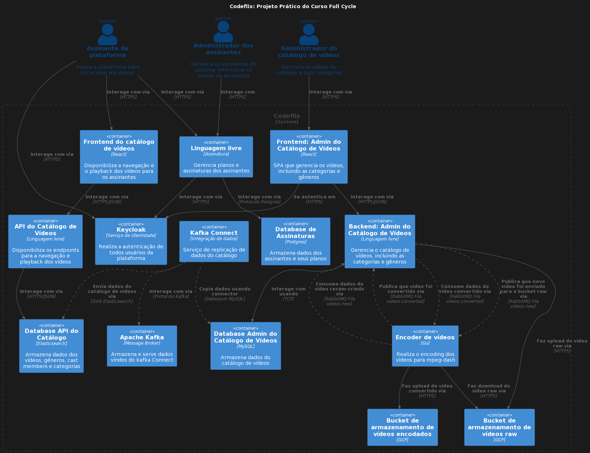

# Codeflix

### Codeflix, what is it? Features:

- It's a kind of a Netflix;
- It has customer subscription (we will have a specific microservice for this purpose);
- Video catalog for browsing;
- Video playback;
- Full text search in the catalog;
- Processing and encoding of videos (Made in Go);
- Administration of the video catalog;
- Administration of the subscription service;
- Authentication;

### Architectural decisions

- Architecture based on microservices;
- Technology suitable for each context (e.g. Go to process videos);
- Each microservice has its own CI/CD process;

### Scalability

- It will be a horizontal scale, made with k8s.
- The scaling process can be configured at the microservice level;
- All microservices will work stateless;
- When uploading any type of asset, it will be stored in Cloud Storage;
- The scaling process strategy will be increasing the number of K8s PODs;
- The autoscaling process will be through HPA (Horizontal pod autoscaler);

### Service Discover

- It will not be necessary to use Consul, K8s will do this instead;

### Eventual Consistency

- Each microservice will have its own database and communication will be asynchronous;
- Eventually the data may become inconsistent;
- The microservice will only duplicate the data necessary for its context;
- We will use Kafka Connect as a data replicator;

### Messaging

- Communication between microservices using RabbitMQ;
- There is no single truth about the choice made (as it could be Kafka, SNS, etc...);

### Resilience and Self healing

- To ensure resilience if one or more microservices go down, queues are essential;
- If a message is forwarded in the wrong pattern to a microservice, it can be forwarded to a dead-letter queue;
- If a container cannot handle certain traffic, we will have a circuit breaker in action and it will be recreated or restarted;

### Authentication

- Keycloak;
- OpenID Connect;
- Customization of the theme using react;
- Sharing of public key with services to verify the authenticity of tokens;
- Various types of ACL;
- Authentication flow for frontend and backend;

### Microservices:

- Backend Admin of the Video Catalog;
- Frontend Admin of the Video Catalog;
- Video Encoder;
- Video Catalog API backend;
- Frontend of the Video Catalog;
- Subscription to Codeflix by the customer;
- Authentication between Microservices with Keycloak;
- Asynchronous communication between Microservices with RabbitMQ;
- Data replication using Apache Kafka and Kafka Connect;

### Development and deployment

- Docker is the protagonist of the development environment;
- For each PR a CI process will be generated using Github Actions;
- The CI process will: Upload the docker application, Run the tests, Use sonarqube;
- In case the merge happens, the CD process takes place;
- The CD process will: Generate the Docker image, Upload the image to a container registry, Execute the deployment on K8s;

### Kubernetes

- Managed cluster
- Deployment;
- Startup, Readiness and Liveness Probe for self healing;
- HPA to scale horizontally;

### Cloud providers

- IaC (Infra as code)
- Terraform, Ansible
- AWS, GCP and Azure;

### C4 Diagram

